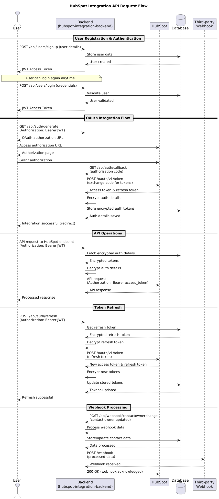
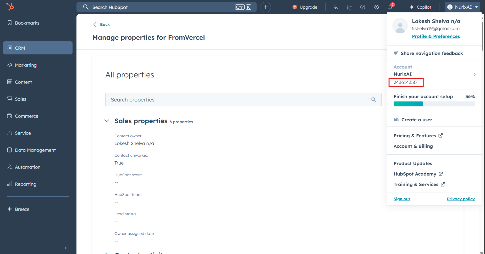
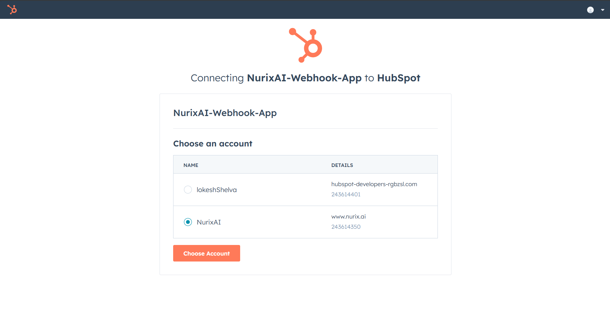

# HubSpot Integration API

A comprehensive Node.js API service for integrating with HubSpot CRM. 

## Features

- **Contact Management**: Create new contacts with designated contact owners
- **Custom Properties**: Create custom properties for enhanced data tracking
- **Property Updates**: Update custom properties on existing contacts
- **Webhook Integration**: Automated workflow triggers when contact ownership changes
- **Authentication**: Secure JWT-based authentication system

## Tech Stack

- **Runtime**: Node.js with TypeScript
- **Framework**: Express.js
- **Database**: MongoDB with Mongoose ODM
- **Authentication**: JWT (JSON Web Tokens)
- **Validation**: Custom middleware for request validation
- **Deployment**: Vercel serverless functions
- **HubSpot Integration**: Official HubSpot API

## Running and testing the API

### Dev Setup

If you want to run locally. follow the [Development Setup Guide](docs/dev-setup.md) for detailed instructions on setting up the development environment.

The app is also deployed on Vercel, and you can access it at [https://hubspot-integration-nu.vercel.app](https://hubspot-integration-nu.vercel.app).

### Testing Flow

Below is the high level flow



Create a hubspot account, if you do not have one already, and follow the steps below to test the application.

### Step 1: Create User Account

**Postman Request:** `User > POST Create user`

**Endpoint:** `/api/users/signup`

Create a new user account in the system to get a JWT access token. This token is required for all subsequent API calls. The response will contain your JWT token which you need to save for authentication.

**Payload Example:**

| Name  | Type   | Description                      |
|-------|--------|----------------------------------|
| username | string | Unique username for the account |
| password | string | Secure password for the account |
| user_account_id | string | Unique identifier of the hubspot user account |

You can get the user account number from your HubSpot account settings or create a new user in HubSpot to get this ID.


**Next Step:** The JWT token from this response should be used in all future requests.

### Step 2: User Login (Optional)

**Postman Request:** `User > POST Login`

**Endpoint:** `/api/users/login`

If you already have an account, use this endpoint to get a fresh JWT token. This is useful if your previous token has expired or if you're returning to use the API after some time.

**Payload Example:**

| Name  | Type   | Description                      |
|-------|--------|----------------------------------|
| username | string | Unique username for the account |
| password | string | Secure password for the account |

**When to use:** Skip this step if you just created a new account in Step 1.

### Step 3: Generate OAuth Authorization URL

**Postman Request:** `OAuth & Token Management > GET Generate OAuth Url`

**Endpoint:** `/api/auth/generate`

This creates the HubSpot OAuth authorization URL that you need to visit in your browser. The response contains the authorization URL that will redirect you to HubSpot's authorization page where you can grant permissions.

**Important:** Make sure your JWT token from Step 1 or 2 is set in the Authorization header.

### Step 4: Authorize with HubSpot

**Action Required:** Open the authorization URL from Step 3 in your web browser, log into HubSpot, and grant the requested permissions.


**What happens:** HubSpot will redirect you back to the configured callback URL with an authorization code. The backend will automatically process this callback and store the encrypted OAuth tokens in the database. No Postman request needed- this happens in the browser and your backend handles the callback automatically.

**Note**: You might see that the app is not verified by HubSpot. This is expected for development apps. You can proceed with the authorization.

### Step 5: Create Custom Properties

**Postman Request:** `Hubspot > POST Create custom properties`

**Endpoint:** `/api/hubspot/contacts/properties`

Create custom properties in HubSpot that you can use to store additional information on contacts. This is useful for extending HubSpot's default contact properties with your specific business needs. The payload is already present as part of the postman collection.

### Step 6: Create HubSpot Contact

**Postman Request:** `Hubspot > POST Create contact`

**Endpoint:** `/api/hubspot/contacts`

Create a new contact in your HubSpot account through the integration. This demonstrates that your OAuth connection is working and you can perform write operations in HubSpot. You can give value to custom properties created in Step 5.

**Sample Payload:**

```json
{
    "contact_owner": "5shelva19@gmail.com",
    "properties": {
        "firstname": "FromVercel2",
        "email": "newUser2@vercel.com",
        "candidate_experience": 8,
        "candidate_date_of_joining": "2025-01-10",
        "candidate_name": "John Doe",
        "candidate_past_company": "Nurix AI",
        "candidate_number": "+91987654321"
    }
}
```

**Note**: Contact owner should be a valid email address of a user in your HubSpot account, preferably the one that gave access to the integration in Step 4.

### Step 7: Update HubSpot Contact

**Postman Request:** `Hubspot > PATCH Update contact`

**Endpoint:** `/api/hubspot/contacts/properties`

Update an existing contact in HubSpot.

**Payload Example:**

```json
{
    "email": "newuser@vercel.com",
    "properties": {
        "candidate_experience": 2,
        // other properties to update
    }
}
```

**Note**: Here the email field is the email of the contact you want to update, **not** the contact owner.

### Step 8: Test Webhook Functionality

**Postman Request:** `POST Webhook test`

**Purpose:** Test the webhook processing functionality to ensure your system can handle incoming webhooks from HubSpot. This simulates what happens when HubSpot sends a webhook about contact owner changes.

**Note**: The webhook should have activated for the contact created in Step 6, since it can be consider as a change in contact ownership. If you are using the deployed version, you can use check the webhook hits in [webhook.site](https://webhook.site/#!/view/7fc078a2-bfbf-4334-abeb-73c51fea6036/f8352138-2109-4e25-8cd5-abfda22a1c45/1)

### Step 9: Refresh OAuth Token (When Needed)

**Postman Request:** `OAuth & Token Management > POST Refresh OAuth token`

**Purpose:** Refresh your HubSpot OAuth access token when it expires. 

**When to use:** Use this when you get authentication errors from HubSpot API calls, or proactively before tokens expire.

### Step 10: Refresh User Token (When Needed)

**Postman Request:** `User > POST Refresh token`

**Purpose:** Refresh your JWT access token for the integration backend when it expires. This keeps your authentication with the backend API current.

**When to use:** Use this when you get 401 unauthorized errors from the backend API.
